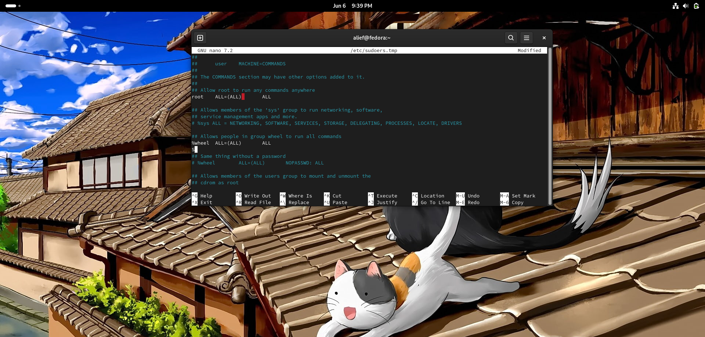

# hardening_vulnberability_fedora

## Make container

```markdown
toolbox create f35-base
toolbox enter f35-base
```

## Securing Accounts and Authentication

### Accounts

make a group

```
groups alief wheel
```

```
groups
```

```
sudo visudo
```



add user

```
sudo useradd -G wheel himawan
```

Give sudo permission to account

```
sudo visudo
```

give sudo privileges to user

```
alief ALL=(ALL:ALL) ALL
```

check it

```
su -alief
sudo whoami
```

disable root account

```
sudo passwd -l root
```

check list user account

```
awk -F':' '{ print $1}' /etc/passwd
```

to delete user

```
sudo userdel -r username
```

### Password Policies

```
sudo nano /etc/pam.d/common-password
```

add it

```
password requisite pam_pwquality.so retry=5 minlen=12 dcredit=-1 ucredit=-1 ocredit=-1 lcredit=-1
```

```
sudo pwck
```

### configure password hashing

```
sudo nano /etc/login.defs
```

```
SHA_CRYPT_MIN_ROUNDS 5000
SHA_CRYPT_MAX_ROUNDS 5000
```

### Configure Minimum and Maximum Password Age

`add in /etc/login.defs`

```
PASS_MIN_DAYS 7
PASS_MAX_DAYS 90
```

```
UMASK 027
```

### Lockout Policy

```
sudo nano /etc/pam.d/common-auth
```

add it

```
auth required pam_tally2.so deny=5 unlock_time=900
```

## Services

### Disable Unnecessary Services

check all running services

```
systemctl --type=service --state=running
```

check spesific service

```
sudo systemd-analyze security sshd
```

stop avahi daemon`

```
sudo systemctl stop avahi-daemon.service
sudo systemctl disable avahi-daemon.service
```

### Secure Necessary Services

misal ssh

```
sudo nano /etc/ssh/sshd_config
```

add this line

```
PermitRootLogin no
PasswordAuthentication no
PermitEmptyPasswords no
```

## Network

### Add IP name and FQDN to /etc/hosts

```
sudo nano /etc/hosts
```

```
127.0.0.1   localhost
::1         localhost
{IP linux} myhostname myhostname.mydomain
```

### Disable Unnecessary Protocols

```
sudo nano /etc/modprobe.d/blacklist.conf
```

```
blacklist dccp
blacklist sctp
blacklist rds
blacklist tipc
```

### Firewall configuration

```markdown
sudo systemctl enable firewalld
sudo systemctl start firewalld
sudo firewall-cmd --add-service=ssh --permanent
sudo firewall-cmd --reload
```

### Disable IPV6

```
sudo nano /etc/sysctl.conf
```

```
net.ipv6.conf.all.disable_ipv6 = 1
net.ipv6.conf.default.disable_ipv6 = 1
net.ipv6.conf.lo.disable_ipv6 = 1
```

```
sudo sysctl -p
```

### Enable Process Accounting

```

```

### Enable systat

```
sudo rpm-ostree install sysstat
sudo systemctl enable --now sysstat
```

### Configure auditd

```
sudo rpm-ostree install audit
sudo systemctl enable --now auditd
```

## Logging & Auditing

### Check logging

```
sudo rpm-ostree install rsyslog
sudo systemctl reboot

sudo systemctl enable rsyslog
sudo systemctl start rsyslog
```

### Configure Log Rotation

```
sudo nano /etc/logrotate.conf

```

```
/var/log/wtmp {
    monthly
    create 0664 root utmp
    minsize 1M
    rotate 1
}
```

### Check deleted file in Use

```
sudo lsof | grep deleted
```

### Add Legal Banner to /etc/issue and /etc/issue.net

```
echo "Authorized users only. All activity may be monitored and reported." | sudo tee /etc/issue
echo "Authorized users only. All activity may be monitored and reported." | sudo tee /etc/issue.net
```

## File Permission and integrity

### Set Appropriate File Permissions:

```
sudo chmod 600 /etc/ssh/sshd_config
sudo chown root:root /etc/ssh/sshd_config
```

### configure aide

```
sudo rpm-ostree install aide
sudo aide --init
sudo mv /var/lib/aide/aide.db.new /var/lib/aide/aide.db
```

```
sudo crontab -e
```

```
sudo crontab -e
```

### Kernel Hardening

```
rpm-ostree upgrade
```

```
sudo nano /etc/sysctl.conf
```

```
net.ipv4.ip_forward = 0
net.ipv4.conf.all.send_redirects = 0
net.ipv4.conf.default.send_redirects = 0
kernel.randomize_va_space = 2
```

## USB and Storage Drivers

```
sudo nano /etc/modprobe.d/blacklist.conf
```

```
blacklist usb_storage
blacklist firewire_ohci
```

## Check and Tweak Sysctl Values

```
sudo nano /etc/sysctl.conf
```

```
sudo sysctl -p
```

### Malware Scanner

```
sudo rpm-ostree install rkhunter
sudo rkhunter --update
sudo rkhunter --checkall
```
